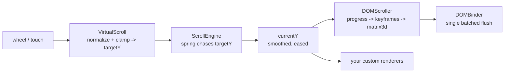

# @zakkster/lite-scroll-rig-pro

> Zero-GC scroll-driven transform rig. A spring smooths stepped wheel/touch input into a single scroll value; pre-measured intersection bounds and a keyframe pool turn that value into batched `matrix3d` transforms. Built for 16ms frame budgets and sessions that run for hours.

[](https://www.npmjs.com/package/@zakkster/lite-scroll-rig-pro)
[](https://github.com/sponsors/PeshoVurtoleta)
[](https://bundlephobia.com/result?p=@zakkster/lite-scroll-rig-pro)
[](https://www.npmjs.com/package/@zakkster/lite-scroll-rig-pro)
[](https://www.npmjs.com/package/@zakkster/lite-scroll-rig-pro)


[](LICENSE.txt)

A smooth-scroll engine in the Lenis / locomotive-scroll family, rebuilt under the `@zakkster` zero-GC rules: the animation frame loop performs **no heap allocation** after setup, all per-frame math writes into pre-allocated typed arrays, and the transform batch is flushed in a single pass. It leans on the rest of the ecosystem for the pieces that already exist -- spring physics, keyframe evaluation, gesture handling, and the DOM transform binder -- rather than re-implementing them.

```bash
npm install @zakkster/lite-scroll-rig-pro
```

```js
import { ScrollEngine, DOMScroller } from "@zakkster/lite-scroll-rig-pro";
import { KeyframePool } from "@zakkster/lite-keyframe";

// 4 keyframe tracks per element: [translateX, translateY, scale, rotateZ]
const cards = [...document.querySelectorAll(".card")];
const pool = new KeyframePool(cards.length * 4, 3);
cards.forEach((_, i) => {
  const row = i * 4;
  pool.addKey(row + 2, 0, 0.85);   // scale in ...
  pool.addKey(row + 2, 0.5, 1);
  pool.addKey(row + 2, 1, 0.85);   // ... and back out as it leaves
  pool.addKey(row + 3, 0, -6);     // rotateZ sweeps -6deg -> 6deg
  pool.addKey(row + 3, 1, 6);
});

const engine = new ScrollEngine(window);
engine.addRenderer(new DOMScroller(cards, pool));
engine.resize();
engine.start();
```

Synchronous frame loop, spring-eased motion, zero per-frame garbage.

---

## Table of contents

- [Why this exists](#why-this-exists)
- [The pipeline in one diagram](#the-pipeline-in-one-diagram)
- [How interpolation works](#how-interpolation-works)
- [What you get](#what-you-get)
- [API reference](#api-reference)
- [The zero-GC hot path](#the-zero-gc-hot-path)
- [Resize invalidation](#resize-invalidation)
- [Accessibility](#accessibility)
- [Testing](#testing)
- [What this is not](#what-this-is-not)
- [Ecosystem](#ecosystem)
- [License](#license)

---

## Why this exists

Smooth-scroll libraries all do the same three things: intercept the native scroll, ease toward a target, and drive transforms from the eased value. The differences live in the frame loop, and most libraries allocate there -- a closure per element, an object per frame, a fresh array for the visible set. On a 60fps overlay with a strict bundle budget, that allocation is what eventually stalls a frame.

`lite-scroll-rig-pro` was built so the steady-state frame loop touches no heap:

1. **No allocation after setup.** Bounds are measured once into a `Float32Array`; matrices are composed into a shared buffer; the DOM flush reuses that buffer. `render(currentY)` allocates nothing.
2. **One layout read pass.** `getBoundingClientRect` is called only in `measure()` -- on load and on resize -- never inside the frame loop.
3. **Injectable everything.** Input, spring, window, rAF, gesture factory, and `ResizeObserver` are all injectable, so the whole rig runs headlessly under `node:test`.

---

## The pipeline in one diagram



`VirtualScroll` owns the raw input. `ScrollEngine` owns the spring and the frame loop. Renderers receive the smoothed `currentY` and decide what to do with it -- `DOMScroller` is the built-in one, but any object with a `render(currentY)` method works.

---

## How interpolation works

The raw `targetY` from `VirtualScroll` is **stepped** -- a mouse wheel emits discrete deltas, so the value jumps. It is never handed to renderers directly. Instead, `ScrollEngine` runs a spring (from [`@zakkster/lite-spring`](https://www.npmjs.com/package/@zakkster/lite-spring)) whose target is chased each frame:

```js
// inside ScrollEngine._tick(time)
this.spring.target = this.input.targetY;   // the jumpy goal
this.currentY = this.spring.update(dt);    // the smoothed, eased value
```

`currentY` is what every renderer receives and what feeds `computeProgress` / `inverseLerp`. It is a **spring, not a lerp** -- the difference matters for feel: a spring carries velocity, so a fast flick overshoots slightly and settles, where a fixed-rate lerp always eases identically regardless of input speed. Swap the character in one line via the `preset` option (`"gentle"`, `"snappy"`, ...) or inject your own spring instance.

Two guards wrap that step:

- **`dt` is clamped** (default 50ms). A backgrounded tab that resumes after several seconds would otherwise feed the spring one enormous timestep and lurch the page. The clamp caps the catch-up.
- **`prefers-reduced-motion` bypasses the spring.** When the user asks for reduced motion, `currentY = targetY` directly, so the page tracks input 1:1 with no easing.

---

## What you get

- **`ScrollEngine(target, options?)`** -- owns input + spring + frame loop. `addRenderer`, `resize`, `start`, `destroy`.
- **`VirtualScroll(target, options?)`** -- normalizes wheel (with `deltaMode` handling) and touch (via a pinch-safe gesture) into a clamped `targetY`.
- **`DOMScroller(elements, pool, options?)`** -- maps scroll progress to keyframed `matrix3d` and batches the flush. A ready-made renderer.
- **`MetricsCache(elements, win?, options?)`** -- pre-measures absolute Y-bounds; optional `ResizeObserver` auto-invalidation.
- **`composeMatrix2D(...)`** -- writes a column-major `matrix3d` into a buffer.
- **`writeIntersectionBounds` / `calculateIntersectionBounds` / `computeProgress` / `computeParallaxOffset`** -- the spatial math, in zero-alloc and convenience forms.

Full type definitions ship in [`src/index.d.ts`](src/index.d.ts).

---

## API reference

### `ScrollEngine(target, options?)`

| Option            | Default            | Notes                                                        |
| ----------------- | ------------------ | ------------------------------------------------------------ |
| `preset`          | `"gentle"`         | lite-spring preset name                                      |
| `maxDeltaTime`    | `0.05`             | dt clamp in seconds                                          |
| `getMaxScroll`    | documentElement    | `() => number`; override the scroll ceiling                  |
| `reducedMotion`   | from `matchMedia`  | force the reduced-motion bypass on/off                       |
| `keyboard`        | `true`             | bind window keydown scrolling; `false` detaches only keydown |
| `multiplier`      | `1.2`              | forwarded to `VirtualScroll` (wheel speed)                   |
| `touchMultiplier` | `1.5`              | forwarded to `VirtualScroll` (touch speed)                   |
| `input` / `spring` / `win` / `raf` / `cancelRaf` / `matchMedia` | -- | injection points for testing |

`addRenderer(renderer)` registers `{ render(currentY), resize?() }` and calls `resize()` once to seed layout. `resize()` recomputes the ceiling and re-measures renderers. `start()` snaps to `window.scrollY` and begins the loop. `destroy()` cancels the loop, drops renderers, and tears down the input.

### `VirtualScroll(target, options?)`

Wheel is normalized by `deltaMode` (pixel / line x40 / page x800) then scaled by `multiplier`. Touch and pen route through [`@zakkster/lite-gesture`](https://www.npmjs.com/package/@zakkster/lite-gesture)'s `GestureTracker`, which reports a per-frame `frameDy` and fires only for pans -- so a two-finger pinch never scrolls. `targetY` is clamped to `[0, maxScroll]`. `createTracker` is injectable.

### `DOMScroller(elements, pool, options?)`

Expects the pool to hold `elements.length * 4` rows in `[tx, ty, scale, rotZ]` order. Each frame, for each element: `t = clamp(inverseLerp(enterY, exitY, currentY), 0, 1)`, evaluate the four rows at `t`, compose a matrix, and flush the batch through the binder. `binder`, `win`, `observe`, and `ResizeObserverCtor` are injectable/optional.

### `MetricsCache(elements, win?, options?)`

`measure()` writes `[enterY, exitY]` per element into `bounds`. With `{ observe: true }` it attaches a `ResizeObserver` that re-measures on element size changes and calls `onResize`.

---

## The zero-GC hot path

`DOMScroller.render(currentY)` is the per-frame function. It:

- reads bounds from a `Float32Array` (no layout read),
- calls `pool.eval(row, t)` (cursor tracked in the pool's own typed array, no alloc),
- writes into a pre-allocated matrix buffer via `composeMatrix2D`,
- hands that same buffer to the binder each frame.

No closures, no intermediate objects, no per-frame arrays. The intersection and matrix math were verified allocation-free under `--expose-gc` during development. The design target is a full frame's headroom left for your own work inside the 16ms budget; measure against your own content and element count rather than trusting a synthetic number.

---

## Resize invalidation

Bounds go stale whenever layout shifts. Two paths keep them fresh:

- **Window resize / orientation change** -- call `engine.resize()` from your own listener; it re-measures every renderer.
- **Element size changes** -- images finishing load, fonts swapping, content mutating. These do not fire a window resize, so pass `{ observe: true }` to `DOMScroller` (or `MetricsCache`). A `ResizeObserver` then re-measures automatically and invalidates the binder. When one element changes height, everything below it shifts, so the whole set is recomputed, not just the observed element.

---

## Accessibility

This rig hijacks wheel and touch input (`preventDefault` on wheel), which is inherent to smooth-scroll libraries. Three behaviors keep it usable rather than trapping:

- **Keyboard scrolling, on by default.** A window `keydown` listener drives the arrow keys (`+/-40 px`), `PageUp` / `PageDown` and `Space` / `Shift+Space` (`+/-0.9 x innerHeight`), `Home` (top), and `End` (bottom). Focus in an interactive control -- `INPUT`, `TEXTAREA`, `SELECT`, `BUTTON`, or `contenteditable` -- suppresses the rig entirely, so typing and control operation are never stolen. The browser's own keyboard scroll is `preventDefault`-ed only when the rig owns the event target, so keys never double-count. Opt out with `{ keyboard: false }` (native scroll reconciliation stays on).
- **Native scroll reconciliation -- native wins.** A scrollbar drag or an in-page anchor jump (`#section`, `scrollIntoView`) moves the real `window.scrollY`; the rig reconciles its target to that position rather than fighting it. A jump of `200 px` or more snaps the spring so the navigation lands in one frame; smaller moves ease smoothly.
- **Reduced motion.** `prefers-reduced-motion` disables the spring out of the box (input tracks 1:1), honored live if the setting changes mid-session.

What it does **not** do: the rig is transform-only and never calls `window.scrollTo`, so it has **no scrollbar of its own** and does not synchronize the native scrollbar thumb to the animated position. The native scrollbar reflects the document's real position, not `currentY`. Still consider whether hijacked scroll is appropriate for your audience before shipping.

---

## Testing

```bash
npm test          # full node:test suite
npm run test:gc   # same suite under --expose-gc
npm run test:coverage
```

Every module is covered with injected fakes -- a fake gesture factory, spring, window, rAF, binder, and `ResizeObserver` -- so the suite runs with no DOM and no browser.

---

## What this is not

- **Not a native-scroll polyfill.** It replaces native scroll with a virtual one; it does not enhance the browser's own scrolling.
- **Not a layout or pinning framework.** It drives transforms from a scroll value. Sticky/pinned sections, horizontal galleries, etc. are things you compose on top.
- **Not a physics engine.** The spring is a single 1-D critically-tunable spring for scroll feel, nothing more.
- **Not batteries-included for opacity/filters.** The built-in renderer animates `matrix3d` (translate/scale/rotate). Other properties are a custom renderer away.

---

## Ecosystem

Built on the `@zakkster` zero-GC stack:
[`lite-spring`](https://www.npmjs.com/package/@zakkster/lite-spring) (interpolation) *
[`lite-keyframe`](https://www.npmjs.com/package/@zakkster/lite-keyframe) (track evaluation) *
[`lite-gesture`](https://www.npmjs.com/package/@zakkster/lite-gesture) (pinch-safe touch) *
[`lite-dom-binder`](https://www.npmjs.com/package/@zakkster/lite-dom-binder) (batched transforms) *
[`lite-lerp`](https://www.npmjs.com/package/@zakkster/lite-lerp) (clamp / inverseLerp)

---

## License

MIT (c) Zahary Shinikchiev
